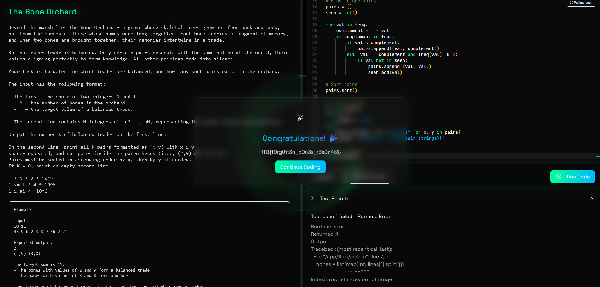

# The Bone Orchard

## Challenge Description

Beyond the marsh lies the Bone Orchard — a grove where skeletal trees grow not from bark and seed, but from the marrow of those whose names were long forgotten. Each bone carries a fragment of memory, and when two bones are brought together, their memories intertwine in a trade.  

But not every trade is balanced. Only certain pairs resonate with the same hollow of the world, their values aligning perfectly to form knowledge. All other pairings fade into silence.  

Your task is to determine which trades are balanced, and how many such pairs exist in the orchard.

The input has the following format:

- The first line contains two integers N and T.  
  - N — the number of bones in the orchard.  
  - T — the target value of a balanced trade.  

- The second line contains N integers a1, a2, …, aN, representing the values etched into each bone.

Output the number K of balanced trades on the first line.

On the second line, print all K pairs formatted as (x,y) with x ≤ y, 
space-separated, and no spaces inside the parentheses (i.e., (2,9) not (2, 9)).
Pairs must be sorted in ascending order by x, then by y if needed.
If K = 0, print an empty second line.

```
1 ≤ N ≤ 2 * 10^5
1 <= T ≤ 4 * 10^5
1 ≤ ai <= 10^6
```

### Example:

Input:
10 11
45 9 6 2 3 8 9 56 2 21

Expected output:
2
(2,9) (3,8)

The target sum is 11.
- The bones with values of 2 and 9 form a balanced trade.  
- The bones with values of 3 and 8 form another.  

Thus there are 2 balanced trades in total, and they are listed in sorted order.


---


