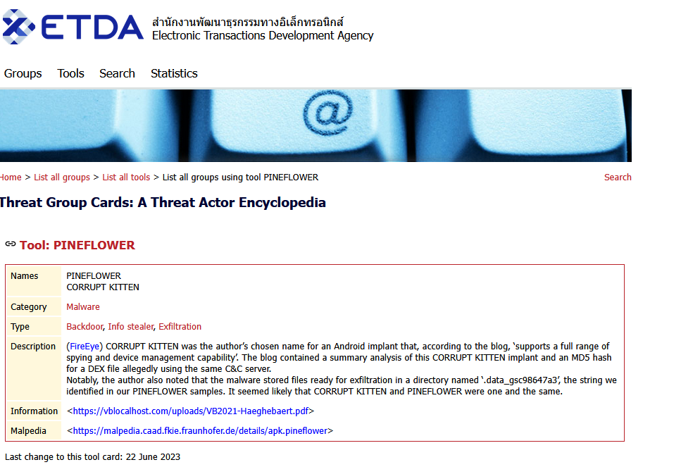
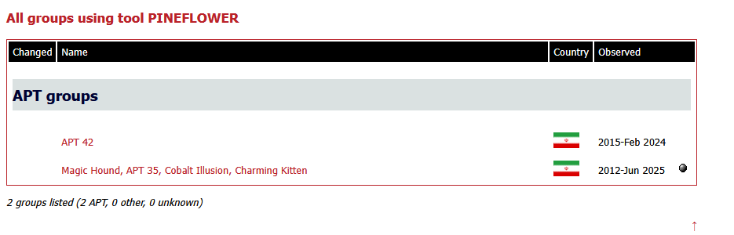
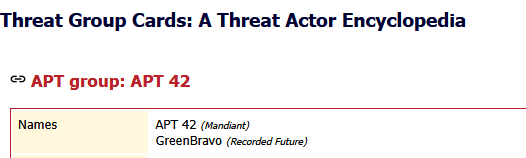

# 🌐 The Hidden Grave Marker

## Challenge Prompt
A watcher's device in Hollow Mere village went silent—refused to wake, refused to speak. When Brynn examined its memory, she found something that shouldn't exist: a folder named `.data_gsc98647a3`, hidden like a grave marker in a forgotten cemetery. No legitimate tool creates such cryptic names. This is an artifact, a fingerprint left by something malicious that passed through. The folder itself is a clue—a signature in the digital earth. Brynn must investigate this strange naming pattern through malware records and shadow-threat databases, identify which tool carves such markers into infected systems, trace it to the group that wields this particular blade, and uncover the infrastructure behind this digital burial. The dead folder speaks, if you know how to listen.

Flag Format: HTB{GroupName} Example (Fictional): HTB{RedFalcon}

**Important:**
* NO spaces
* NO underscores
* NO hyphens Single combined word Capitalize appropriately

---

## Research Steps

### Step 1 - Google Search

### Step 2 - Electronic Transactions Development Agency (EDTA)

### Step 3 - APT 42

### Final Flag

