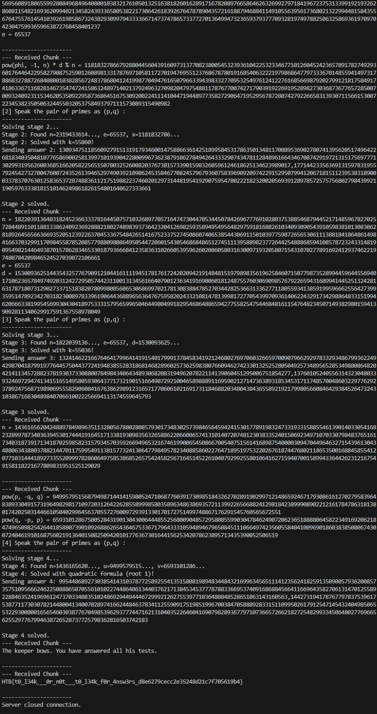

# 🔐 Leaking for Answers

## Challenge Prompt
Willem's path led him to a lone reed-keeper on the marsh bank. The keeper speaks only in riddles and will reveal nothing for free - yet he offers tests, one for each secret he guards. Each riddle is a vetting: answer each in turn, and the keeper will whisper what the fen keeps hidden. Fail, or linger too long answering the questions, and the marsh swallows the night. This is a sourceless riddle stand - connect, answer each of the keeper's four puzzles in sequence, and the final secret will be yours.

---

