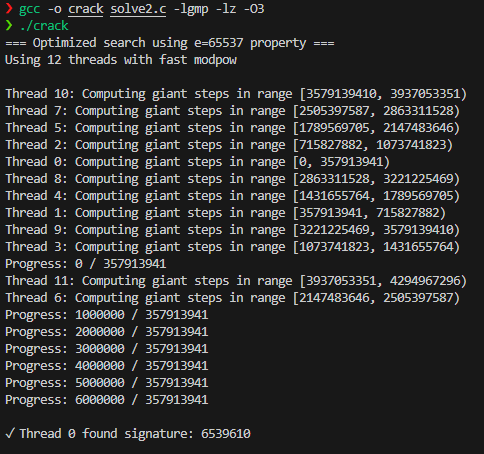
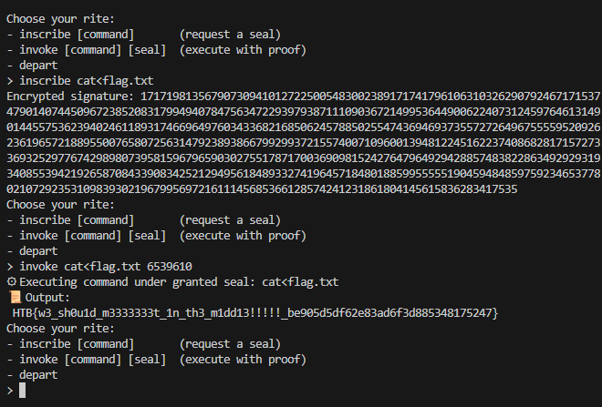

### 3.1 Execution

**1. Connect to the server and extract N and e:**

```bash
nc 159.89.111.158 31244
```

**Extracted Parameters:**
-   `N = 16109715491927928908884179524225216283219387994147326196125509538970007777678289802038023031909170799371585291966413622038250188294559360307725401331342749006004173796090232373242061467834057295552768484415273464216573238339726436408425698206601943643324973330542982697469264812065138308790790382131959936069356436513561672289688548149380686014489176042846612245731510923498673933042607219782401328948746489871806912580488984498583737316740772245245923050149982630851070698000810952212612212838433837919562370029172210139893591314783999500592241543209370459141222070319168079945623938353947522891216550604682176784767`
-   `e = 65537`

**2. Brute-force the CRC32 value and invoke command (using `solve2.c`):**

```bash
gcc -o crack solve2.c -lgmp -lz -O3
./crack
```

**Output:**
```
=== Optimized search using e=65537 property ===
Using 12 threads with fast modpow

Thread 10: Computing giant steps in range [3579139410, 3937053351)
Thread 7: Computing giant steps in range [2505397587, 2863311528)
Thread 5: Computing giant steps in range [1789569705, 2147483646)
Thread 2: Computing giant steps in range [715827882, 1073741823)
Thread 0: Computing giant steps in range [0, 357913941)
Thread 8: Computing giant steps in range [2863311528, 3221225469)
Thread 4: Computing giant steps in range [1431655764, 1789569705)
Thread 1: Computing giant steps in range [357913941, 715827882)
Thread 9: Computing giant steps in range [3221225469, 3579139410)
Thread 3: Computing giant steps in range [1073741823, 1431655764)
Progress: 0 / 357913941
Thread 11: Computing giant steps in range [3937053351, 4294967296)
Thread 6: Computing giant steps in range [2147483646, 2505397587)
Progress: 1000000 / 357913941
Progress: 2000000 / 357913941
Progress: 3000000 / 357913941
Progress: 4000000 / 357913941
Progress: 5000000 / 357913941
Progress: 6000000 / 357913941

✓ Thread 0 found signature: 6539610

Choose your rite:
- inscribe [command] (request a seal)
- invoke [command] [seal] (execute with proof)
- depart
> inscribe cat<flag.txt
Encrypted signature: 171719813567907309410127225005483002389171741796106310326290792467171537
479014074450967238520831799494078475634722939793871110903672149953644900622407312459764613149
014455753623940246118931746696497603433682168506245788502554743694693735572726496755559520926
236196572188955007658072563147923893866799299372155740071096001394812245162237408682817157273
369325297767429898073958159679659030275517871700369098152427647964929428857483822863492929319
34085539421926587084339083425212949561848933274196457184801885995555190459484859759234653778
02107292353109839302196799569721611145685366128574241231861804145615836283417535
Choose your rite:
- inscribe [command] (request a seal)
- invoke [command] [seal] (execute with proof)
- depart
> invoke cat<flag.txt 6539610
Executing command under granted seal: cat<flag.txt
Output:
HTB{w3_sh0u1d_m333333t_1n_th3_m1dd13!!!!_be905d5df62e83ad6f3d885348175247}
Choose your rite:
- inscribe [command] (request a seal)
- invoke [command] [seal] (execute with proof)
- depart
>
```

## 4. Solution & Flag

**Flag:** `HTB{w3_sh0u1d_m333333t_1n_th3_m1dd13!!!!_be905d5df62e83ad6f3d885348175247}`

---




