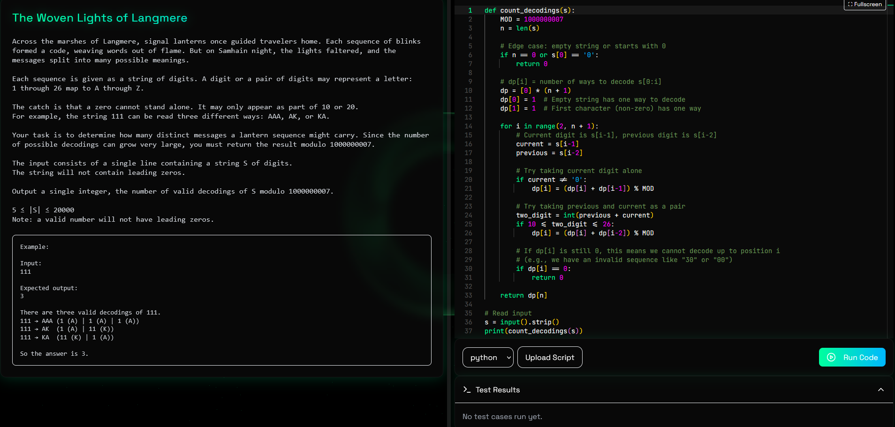

# The Woven Lights of Langmere

## Challenge Description

Across the marshes of Langmere, signal lanterns once guided travelers home. Each sequence of blinks formed a code, weaving words out of flame. But on Samhain night, the lights faltered, and the messages split into many possible meanings.

Each sequence is given as a string of digits. A digit or a pair of digits may represent a letter:
1 through 26 map to A through Z.

The catch is that a zero cannot stand alone. It may only appear as part of 10 or 20.  
For example, the string 111 can be read three different ways: AAA, AK, or KA.

Your task is to determine how many distinct messages a lantern sequence might carry. Since the number of possible decodings can grow very large, you must return the result modulo 1000000007.

The input consists of a single line containing a string S of digits.  
The string will not contain leading zeros.

Output a single integer, the number of valid decodings of S modulo 1000000007.

5 ≤ |S| ≤ 20000
Note: a valid number will not have leading zeros.

---

